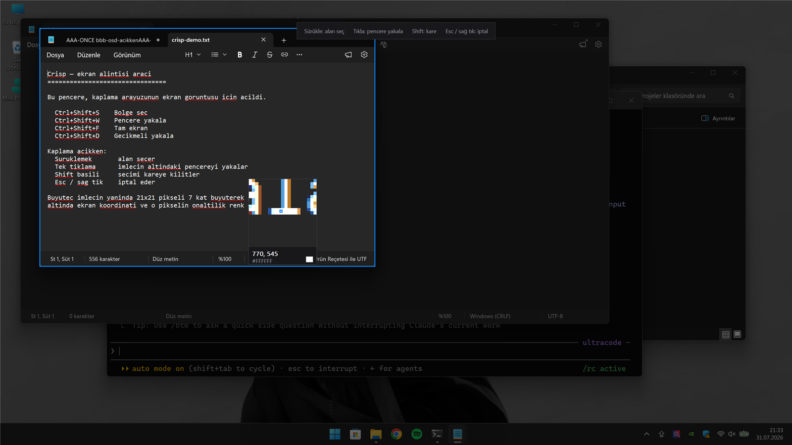
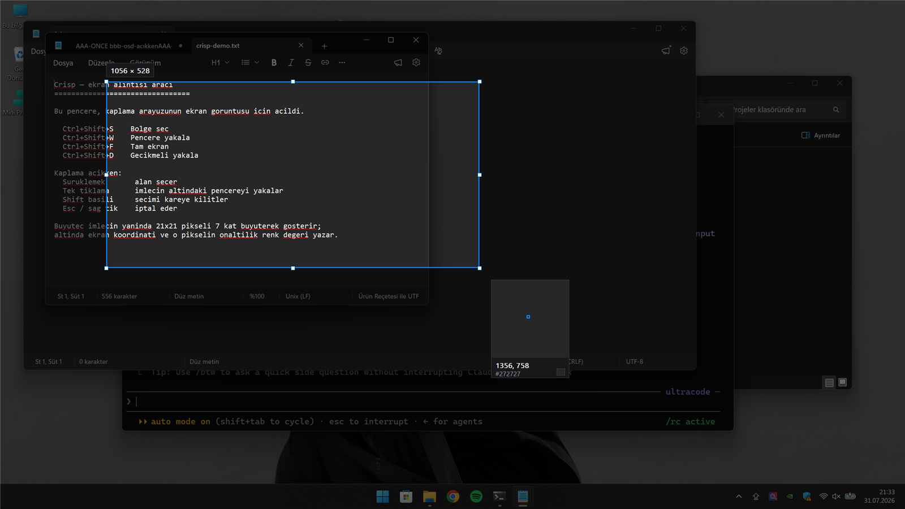
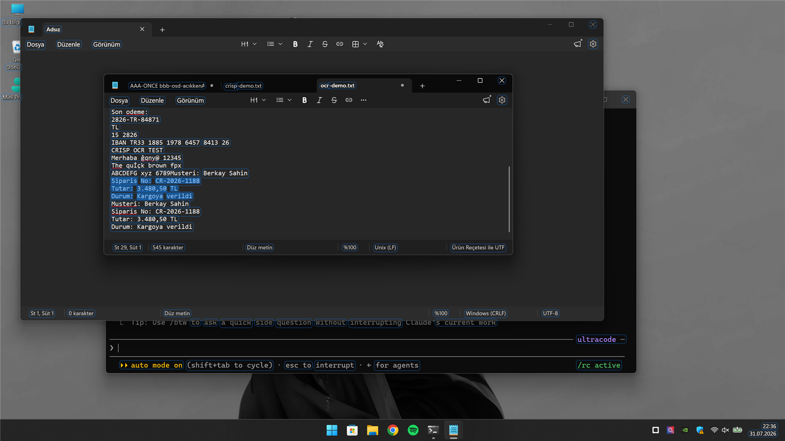
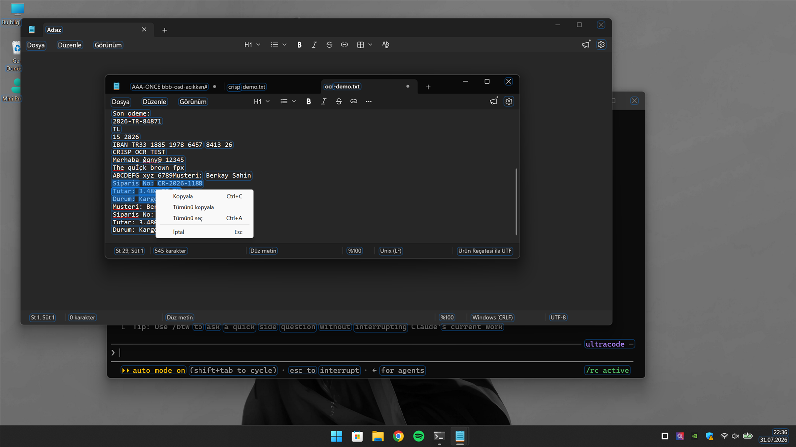
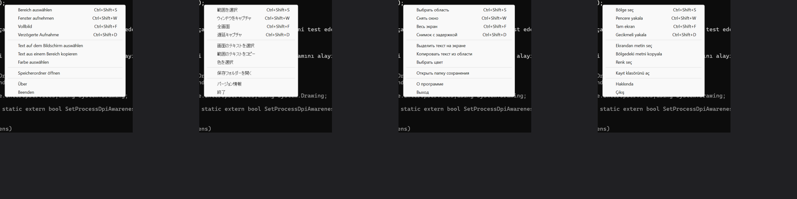
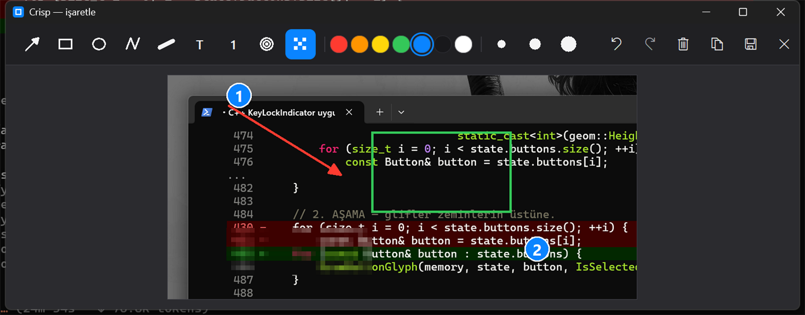
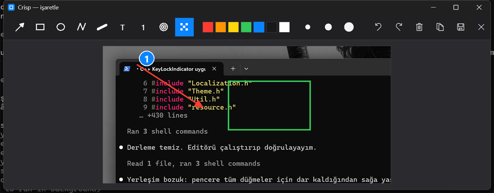
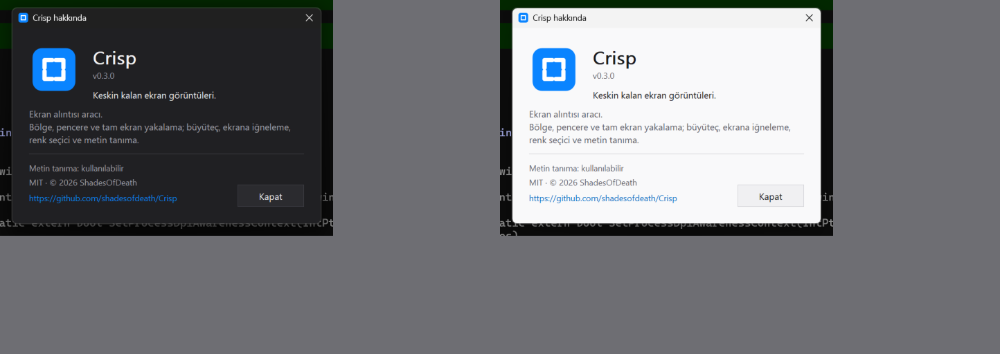
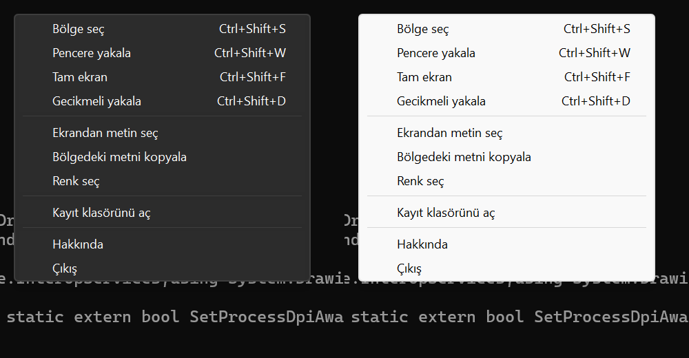

<div align="center">

# Crisp

**Screenshots that stay sharp.**

A native Windows screen capture tool — region, window, full screen — with a
pixel magnifier, annotation, OCR and pin-to-screen.

<br>


<br>

**[Screenshots](#screenshots)** · **[Status](#status)** ·
**[Planned features](#planned-features)** · **[Build](#build)** · **[Tests](#tests)**

</div>

<br>

> **Work in progress.** Capture works end to end — region, window, screen and
> delayed, to the clipboard or a PNG. Annotation, pinning, OCR and history are
> not built yet. See [Status](#status).

<br>

## Screenshots

Hover a window and the frame lights up; click to capture it. The magnifier
follows the cursor with the pixel under it, its coordinates and its colour.

<div align="center">

</div>

<br>

Drag instead and you get a live selection with its size. Everything outside the
selection stays dimmed.

<div align="center">

</div>

<br>

### Text on screen

**Ekrandan metin seç** reads the screen, draws a box around every line of text it
found, and lets you select across them the way you would in a document.

<div align="center">

</div>

Lines are boxed, not words. Boxing every word turns the screen into a wire grid;
a line is the unit a reader actually sees. The line under the cursor gets a
stronger border and a light fill, the selection is filled like text selection,
and the boxes are drawn with antialiased rounded corners on a single composited
alpha layer rather than a few hundred separate blits.

Releasing the mouse **keeps** the selection. Elsewhere in the app letting go
means "done"; here it would take away the chance to look at what you selected.
Right-click for the rest:

<div align="center">

</div>

Drag to select, double-click a word, double-click again for the whole line,
`Ctrl+A` for everything, `Ctrl+C` or `Enter` to copy, `Esc` to cancel.

Reading order is fixed before anything is drawn. The engine orders lines by its
own region analysis, not by where they sit on screen, so with several windows
open a range selection lands on words scattered across the display. Lines are
re-sorted top-to-bottom and words left-to-right first.

Line breaks survive the round trip — selecting three lines puts three lines on
the clipboard. Accuracy is whatever the Windows engine gives you.

**Bölgedeki metni kopyala** is the blunter path: drag a region, get all of its
text at once, no selection step.

<br>

## Why

Windows ships a capable snipping tool, and most free alternatives do the basics
well. Crisp exists for the parts they do not:

- **Pin a capture to the screen.** Compare two things side by side without a
  second monitor or an editor.
- **A real magnifier while selecting.** Pixel-exact selection with live
  coordinates, not a best guess.
- **Text out of an image, offline.** OCR through the engine already in Windows —
  no upload, no account, no extra download.

<br>

## Status

| Area | State |
|---|---|
| Image buffer, capture (region / window / screen) | done, tested |
| Crop, PNG encode and decode | done, tested |
| Clipboard (CF_DIB + PNG) | done, tested |
| Settings (registry + portable `.ini`) | done, tested |
| Window pick and frame bounds | done, tested |
| Selection overlay — dim, magnifier, size readout, square snap | done |
| Tray icon, context menu, global hotkeys | done |
| Delayed capture | done |
| Save as PNG, copy to clipboard | done |
| Pin to screen — drag, wheel zoom, opacity, copy, save as | done |
| OCR — region to text | done |
| Text on screen — boxed lines, drag/word/line select, context menu | done |
| Colour picker | done |
| 16 interface languages, follows the Windows display language | done |
| Light and dark theme, follows Windows live | done |
| PNG and JPEG saving with a quality setting | done |
| Print Screen opens the region overlay | done |
| Custom About window | done |
| Annotation editor — arrow, box, ellipse, pen, highlighter, text, step badges | done |
| Editor colour panel — SV square, hue strip, hex, presets, eyedropper | done |
| Editor thickness dropdown — seven widths, previewed as lines | done |
| Editor save as — PNG / JPEG / WebP, format from the typed extension | done |
| Blur and mosaic | done |
| Undo / redo | done |
| Capture history — thumbnail grid, edit / copy / reveal / delete | done |
| Settings window — every setting, 16 languages, dark and light | done |
| Capture notification — thumbnail, what happened, click to open | done |
| Editor zoom — buttons, wheel, `Ctrl +/-/0`, middle-drag to pan | done |
| Editor text recognition — boxed words, drag to select, copy | done |
| Editor crop, rotate and resize | done |
| Custom message box — themed, replaces every MessageBoxW | done |
| Shutter sound — synthesised, no asset, off by default | done |
| Toolbar tooltips and number-key tool shortcuts | done |
| Grouped toolbar with labels, status-bar zoom slider | done |
| Active window, all monitors, last region | done |
| Capture the mouse cursor | done |
| Delay on every capture mode, with a countdown | done |
| Overlay crosshair, `Ctrl+C` coordinates, monitor keys | done |
| An action per hotkey — twelve actions, six slots | done |
| Command line (`-region`, `foto.png`), open the clipboard image, drag and drop | done |
| "Edit with Crisp" in the Explorer right-click menu | done, tested |
| File name and subfolder templates | done, tested |
| After capture: copy path / copy file / reveal / OCR the text | done |
| Editor selection tool — move, delete, restyle a shape | done |
| Line tool, shape fill, `Shift` locks, translucent highlighter | done |
| Editor effects — flip, trim, margin, greyscale, sepia, sharpen, ± B/C/S | done, tested |
| Scrolling capture | removed — see Known limits |

245 tests pass. See [Tests](#tests).

### Languages

Czech, Dutch, English, French, German, Italian, Japanese, Korean, Polish,
Portuguese (Brazil), Russian, Simplified Chinese, Spanish, Swedish, Turkish,
Ukrainian — picked automatically from your Windows display language, or set
explicitly.

<div align="center">

</div>

### Annotation

Turn on "open the editor" and a capture lands here instead of going straight to
the clipboard.

<div align="center">

</div>

Arrow, rectangle, ellipse, pen, highlighter, text, numbered step badges, blur
and mosaic. `Ctrl+Z` / `Ctrl+Y`, `Ctrl+C` to copy, `Ctrl+S` to save,
`Ctrl+Shift+S` to save as, `Esc` to discard.

The toolbar is grouped and each group is labelled, because a strip of
twenty-odd icons explains the *what* and never the *why they sit together*.
Colour and thickness are single buttons that open a panel:

- **Colour** — a saturation-value square, a hue strip, a hex field that takes
  `#1e90ff` or `#0f0`, 36 presets across three tones, the colours used recently,
  and an eyedropper that borrows the screen-pick overlay. Clicking a preset
  applies it and closes; the square and the strip need `Tamam`.
- **Thickness** — seven widths from 1 to 18 px, each drawn as a line of that
  width in the colour you are drawing with. Three buttons distinguished only by
  the diameter of a dot could not show the difference between 2 px and 4 px.

**Copy and save no longer close the window.** They do the work and say so in the
status bar — copying used to be indistinguishable from crashing.

**Resizing is reversible.** Shrinking to 25 % and going back to 100 % returns
the original pixels, because consecutive resizes work from the image as it was
before the first one. Downscaling averages the whole source area rather than
sampling 2 × 2, so text survives; upscaling uses a cubic filter.

Undo restores **pixels**, not just the shape list:

<div align="center">

</div>

Two undos removed the mosaic and the second badge — and the text under the
mosaic is readable again. Every repaint starts from the untouched capture and
replays the shape list, because painting on top of the current image would leave
a permanent smear where an undone blur used to be.

<br>

### About

Not a message box — its own window, themed, with the app icon and a link to the
repository.

<div align="center">

</div>

<br>

### Theme

Menus, dialogs and title bars follow the Windows theme, and switch live when you
change it.

<div align="center">

</div>

Win32's own menus do not follow the system theme, so this is done by resolving
uxtheme's undocumented dark-mode ordinals at runtime. The alternative was
owner-drawn menus, which would have meant re-implementing the accelerator
column, check marks, keyboard navigation and high-contrast support by hand. The
ordinals are looked up with `GetProcAddress` and degrade to no-ops if missing —
linking them statically would mean the application refuses to start on a Windows
build that dropped one.

Set it to `system`, `light` or `dark`.

Adding one is a `LANGUAGE`/`STRINGTABLE` block in `res/strings.rc` and a row in
`Loc::Languages()`. Nothing else. A half-finished translation is safe: a missing
string falls back to English rather than leaving a blank menu item. Accelerator
labels live in a single language-neutral block — `Ctrl+Shift+S` is the same in
every language and copying it sixteen times would be sixteen times the
maintenance.

### Shortcuts

| | |
|---|---|
| `Ctrl+Shift+S` | Select a region |
| `Ctrl+Shift+W` | Capture the window under the cursor |
| `Ctrl+Shift+F` | Capture the current monitor |
| `Ctrl+Shift+D` | Countdown, then select |

While the overlay is open: drag to select, click to take the highlighted window,
hold `Shift` to lock the selection square, `Enter` to accept, `Esc` or
right-click to cancel.

**Ekrandan metin seç**, **Bölgedeki metni kopyala** and **Renk seç** are in the
tray menu. Text recognition runs on the engine already in Windows — nothing is
uploaded and nothing extra is installed, but it needs an OCR-capable language in
your language profile. About → tells you whether this machine has one.

On a pinned window: drag anywhere to move it, wheel to zoom, double-click for
actual size, `Ctrl+C` to copy, `Ctrl+S` to save, `Esc` to close, right-click for
the rest.

While the overlay is open: `Ctrl+C` copies the selection as `x, y  w × h`,
`Space` takes the monitor under the cursor, `1`–`9` a numbered monitor (left to
right) and `0` the whole virtual desktop.

From the command line: `Crisp.exe -region | -window | -active | -monitor |
-all | -last | -delayed | -text | -ocr | -color | -history`, or
`Crisp.exe picture.png` to open a file in the editor. A second instance hands
the request to the one already running.

Turn on **"Add to the Explorer right-click menu"** in Settings and any image
gets an **Edit with Crisp** entry. It is a registry verb under
`HKEY_CURRENT_USER` — no administrator, no shell extension DLL loaded into
Explorer's process — covering every format Windows calls an image. Started that
way, Crisp closes when the editor closes rather than leaving a tray icon
behind. On Windows 11 third-party verbs sit in the classic menu: *Show more
options*, or `Shift+F10`.

In the annotation editor: `V` selects and moves a shape (`Delete` removes it),
`C` crops, `1`–`0` pick a drawing tool in toolbar order, the wheel zooms
around the pointer, the middle button pans, `Ctrl +` / `Ctrl -` / `Ctrl+0` zoom
in, out and fit, `Ctrl+Z` / `Ctrl+Y` undo and redo, `Ctrl+C` copies, `Ctrl+S`
saves and `Ctrl+Shift+S` saves as. Every toolbar button has a tooltip that also
shows its shortcut. While typing with the text tool, `Enter` breaks a line,
`Ctrl+Enter` finishes the text and `Esc` cancels only that text.

<br>

## Known limits

**Scrolling capture was removed.** The stitching side worked: measure the
static chrome at the top and bottom of two frames, find the vertical offset of
the content between them, append the new rows. The driving side did not. Sending
a wheel event and waiting for the window to finish redrawing behaves differently
in every application — Windows 11 Notepad animates its scroll, so a fixed delay
lands mid-animation, and waiting for two identical frames instead can settle
*before* the scroll has started. Runs of the same test produced 837, 932 and
1087 pixels of output. A feature that works sometimes is worse than one that is
absent, so it is out.

**WebP saving needs the Windows codec.** Windows ships a WebP decoder but the
encoder is an optional component. If it is missing the format is not offered at
all, rather than being offered and silently saving PNG.

**Text recognition needs an OCR language pack.** It uses the engine already in
Windows — nothing is uploaded and nothing extra is installed — but the language
has to be present in your profile. About → says whether this machine has one.

**Print Screen integration is unverified.** The code registers the key and the
path is the same one the tray menu uses, but synthetic key presses are not
delivered for `VK_SNAPSHOT`, so it has never been confirmed by a test — only by
inspection. It needs a physical key press to prove.

**Tested at 150% DPI on one monitor.** Every window is per-monitor DPI aware and
scales its own metrics, and the multi-monitor paths use the monitor under the
cursor, but neither has been exercised on real hardware with mixed scaling.

<br>

## Build

Requires Visual Studio 2022 (MSVC v143) or newer with the C++ toolset, Windows
SDK 10.0.22621+, CMake 3.25+ and Ninja. There are no third-party dependencies
and no package manager.

```powershell
tools\build.ps1 -Config Release -Test
```

Output: `build\Release\Crisp.exe`.

Useful switches:

```powershell
tools\build.ps1 -CoreOnly -Test    # core + tests, no user interface
tools\build.ps1 -Clean             # wipe the build directory first
tools\build.ps1 -Package           # portable ZIP via cpack
```

<br>

## Tests

The build is split so that everything without a user interface lives in
`crisp_core`, and a console runner links against it. That is not an accident of
layout — it is what makes the capture pipeline testable at all:

```powershell
build\Release\crisp_tests.exe
```

The runner is 200 lines with no dependencies. Tests cover selection geometry,
the image buffer, screen capture, PNG round-trips, the clipboard and the
settings store.

What the tests deliberately do **not** assert: anything about what is on screen
at the time. A test that expected particular pixels would pass on one machine
and fail on the next.

<br>

## Licence

MIT · © 2026 ShadesOfDeath
