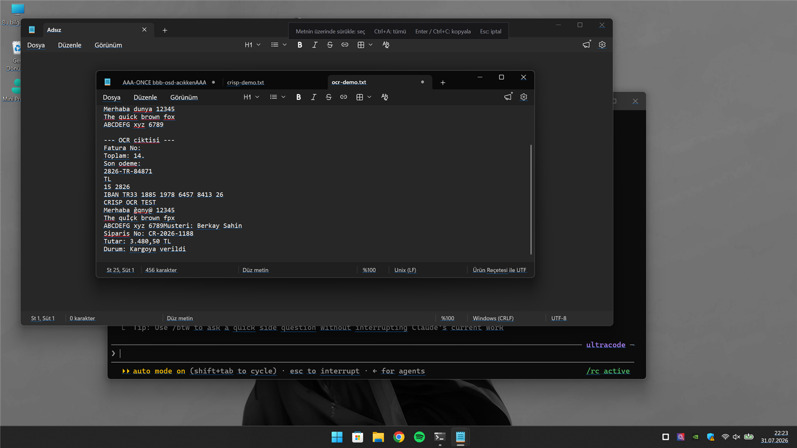

<div align="center">

# Crisp

**Screenshots that stay sharp.**

A native Windows screen capture tool — region, window, full screen — with a
pixel magnifier, annotation, OCR and pin-to-screen.

<br>


<br>

**[Screenshots](#screenshots)** · **[Status](#status)** ·
**[Planned features](#planned-features)** · **[Build](#build)** · **[Tests](#tests)**

</div>

<br>

> **Work in progress.** Capture works end to end — region, window, screen and
> delayed, to the clipboard or a PNG. Annotation, pinning, OCR and history are
> not built yet. See [Status](#status).

<br>

## Screenshots

Hover a window and the frame lights up; click to capture it. The magnifier
follows the cursor with the pixel under it, its coordinates and its colour.

<div align="center">

</div>

<br>

Drag instead and you get a live selection with its size. Everything outside the
selection stays dimmed.

<div align="center">

</div>

<br>

### Text on screen

**Ekrandan metin seç** reads the whole screen, boxes every word it found, and
lets you select across them the way you would select text in a document.

<div align="center">

</div>

The screen is **not dimmed** in this mode — you are choosing words to read, and
at 40 % brightness you could not tell which ones. Unrecognised areas simply have
no underline. Drag across words to select, `Ctrl+A` for everything, `Enter` or
`Ctrl+C` to copy, `Esc` to cancel.

<div align="center">

</div>

Line breaks survive the round trip. Selecting the two lines above puts exactly
two lines on the clipboard, because the text is rebuilt from `OcrResult.Lines`;
`OcrResult.Text` joins every word with a single space and turns an invoice into
one unreadable strip.

Accuracy is whatever the Windows engine gives you — in the screenshot it misread
`Siparis` and one digit of the amount. That is the engine, not the plumbing.

**Bölgedeki metni kopyala** is the older, blunter path: drag a region, get all of
its text at once, no selection step.

<br>

## Why

Windows ships a capable snipping tool, and most free alternatives do the basics
well. Crisp exists for the parts they do not:

- **Pin a capture to the screen.** Compare two things side by side without a
  second monitor or an editor.
- **A real magnifier while selecting.** Pixel-exact selection with live
  coordinates, not a best guess.
- **Text out of an image, offline.** OCR through the engine already in Windows —
  no upload, no account, no extra download.

<br>

## Status

| Area | State |
|---|---|
| Image buffer, capture (region / window / screen) | done, tested |
| Crop, PNG encode and decode | done, tested |
| Clipboard (CF_DIB + PNG) | done, tested |
| Settings (registry + portable `.ini`) | done, tested |
| Window pick and frame bounds | done, tested |
| Selection overlay — dim, magnifier, size readout, square snap | done |
| Tray icon, context menu, global hotkeys | done |
| Delayed capture | done |
| Save as PNG, copy to clipboard | done |
| Pin to screen — drag, wheel zoom, opacity, copy, save as | done |
| OCR — region to text | done |
| Text on screen — scan, box, select, copy | done |
| Colour picker | done |
| Annotation editor | not started |
| Capture history | not started |

113 tests pass. See [Tests](#tests).

### Shortcuts

| | |
|---|---|
| `Ctrl+Shift+S` | Select a region |
| `Ctrl+Shift+W` | Capture the window under the cursor |
| `Ctrl+Shift+F` | Capture the current monitor |
| `Ctrl+Shift+D` | Countdown, then select |

While the overlay is open: drag to select, click to take the highlighted window,
hold `Shift` to lock the selection square, `Enter` to accept, `Esc` or
right-click to cancel.

**Ekrandan metin seç**, **Bölgedeki metni kopyala** and **Renk seç** are in the
tray menu. Text recognition runs on the engine already in Windows — nothing is
uploaded and nothing extra is installed, but it needs an OCR-capable language in
your language profile. About → tells you whether this machine has one.

On a pinned window: drag anywhere to move it, wheel to zoom, double-click for
actual size, `Ctrl+C` to copy, `Ctrl+S` to save, `Esc` to close, right-click for
the rest.

<br>

## Planned features

**Capture** — drag a region, pick a window under the cursor, whole screen or one
monitor, and a countdown capture for menus and tooltips that vanish when you
click.

**After capture** — copy to the clipboard, save as PNG, pin the result on screen
as a floating window, or open it in the annotation editor. Any combination.

**Annotation** — arrows and rectangles, text and highlighter, step number
badges, and blur or pixelate for the parts of a screenshot that should not be
shared.

**Extras** — OCR that lifts text out of the image and onto the clipboard, a pixel
magnifier with live coordinates during selection, a colour picker, and a history
of recent captures.

<br>

## Build

Requires Visual Studio 2022 (MSVC v143) or newer with the C++ toolset, Windows
SDK 10.0.22621+, CMake 3.25+ and Ninja. There are no third-party dependencies
and no package manager.

```powershell
tools\build.ps1 -Config Release -Test
```

Output: `build\Release\Crisp.exe`.

Useful switches:

```powershell
tools\build.ps1 -CoreOnly -Test    # core + tests, no user interface
tools\build.ps1 -Clean             # wipe the build directory first
tools\build.ps1 -Package           # portable ZIP via cpack
```

<br>

## Tests

The build is split so that everything without a user interface lives in
`crisp_core`, and a console runner links against it. That is not an accident of
layout — it is what makes the capture pipeline testable at all:

```powershell
build\Release\crisp_tests.exe
```

The runner is 200 lines with no dependencies. Tests cover selection geometry,
the image buffer, screen capture, PNG round-trips, the clipboard and the
settings store.

What the tests deliberately do **not** assert: anything about what is on screen
at the time. A test that expected particular pixels would pass on one machine
and fail on the next.

<br>

## Licence

MIT · © 2026 ShadesOfDeath
